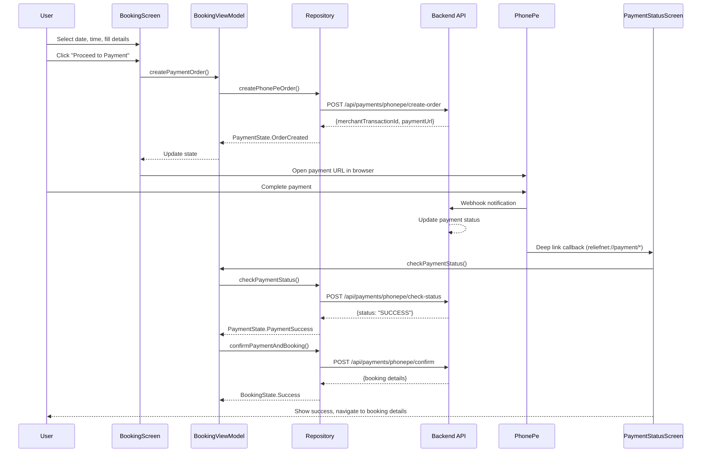

# PhonePe Payment Integration - Android Guide

## Overview
Complete Android integration with PhonePe Payment Gateway for ReliefNet booking system. This document covers all Android components, setup, and usage.

## Architecture

```
┌─────────────────────────────────────────────────────────────┐
│                         UI Layer                            │
│  BookingScreen │ PaymentStatusScreen │ MyBookingsScreen     │
└─────────────────────────────────────────────────────────────┘
                            │
┌─────────────────────────────────────────────────────────────┐
│                      ViewModel Layer                        │
│              BookingViewModel (State Management)            │
└─────────────────────────────────────────────────────────────┘
                            │
┌─────────────────────────────────────────────────────────────┐
│                     Repository Layer                        │
│                   ReliefNetRepository                       │
└─────────────────────────────────────────────────────────────┘
                            │
┌─────────────────────────────────────────────────────────────┐
│                      Network Layer                          │
│      ApiService (Retrofit) │ ApiModels (Data Classes)       │
└─────────────────────────────────────────────────────────────┘
                            │
┌─────────────────────────────────────────────────────────────┐
│                       Utility Layer                         │
│                     PhonePeHelper                           │
└─────────────────────────────────────────────────────────────┘
```

## Payment Flow



## Components Created

### 1. Data Models (ApiModels.kt)

```kotlin
// PhonePe Payment Request/Response Models
data class CreatePaymentOrderPhonePeRequest(
    val amount: Double,
    val doctorId: String,
    val appointmentDate: String,
    val appointmentTime: String
)

data class CreatePaymentOrderPhonePeResponse(
    val merchantTransactionId: String,
    val paymentUrl: String,
    val amount: Double,
    val doctorAmount: Double,
    val platformFee: Double
)

data class CheckPaymentStatusRequest(
    val merchantTransactionId: String
)

data class CheckPaymentStatusResponse(
    val status: String,
    val merchantTransactionId: String,
    val amount: Double?,
    val message: String?
)

data class ConfirmPaymentRequest(
    val merchantTransactionId: String,
    val professionalId: String,
    val appointmentDate: String,
    val appointmentTime: String
)

data class ConfirmPaymentResponse(
    val success: Boolean,
    val booking: Booking?,
    val message: String
)

data class PaymentItemPhonePe(
    val merchantTransactionId: String,
    val amount: Double,
    val status: String,
    val doctorAmount: Double,
    val platformFee: Double,
    val paymentMethod: String
)
```

### 2. API Service (ApiService.kt)

```kotlin
@POST("payments/phonepe/create-order")
suspend fun createPhonePeOrder(
    @Body request: CreatePaymentOrderPhonePeRequest,
    @Header("Authorization") token: String
): Response<CreatePaymentOrderPhonePeResponse>

@POST("payments/phonepe/check-status")
suspend fun checkPaymentStatus(
    @Body request: CheckPaymentStatusRequest,
    @Header("Authorization") token: String
): Response<CheckPaymentStatusResponse>

@POST("payments/phonepe/confirm")
suspend fun confirmPayment(
    @Body request: ConfirmPaymentRequest,
    @Header("Authorization") token: String
): Response<ConfirmPaymentResponse>
```

### 3. Repository Functions (ReliefNetRepository.kt)

```kotlin
// PhonePe Payment Functions
suspend fun createPhonePeOrder(request: CreatePaymentOrderPhonePeRequest): Response<CreatePaymentOrderPhonePeResponse>
suspend fun checkPaymentStatus(request: CheckPaymentStatusRequest): Response<CheckPaymentStatusResponse>
suspend fun confirmPayment(request: ConfirmPaymentRequest): Response<ConfirmPaymentResponse>

// Booking Management
suspend fun createBooking(request: CreateBookingRequest): Response<BookingResponse>
suspend fun confirmBooking(bookingId: String, request: ConfirmBookingRequest): Response<BookingResponse>
suspend fun cancelBooking(bookingId: String, request: CancelBookingRequest): Response<CancelBookingResponse>
suspend fun getBookingStatus(bookingId: String): Response<BookingStatusResponse>
suspend fun getPatientBookings(patientId: String, status: String?): Response<BookingListResponse>
suspend fun getDoctorBookings(doctorId: String, status: String?, date: String?): Response<BookingListResponse>

// Availability Management
suspend fun getDoctorAvailability(doctorId: String, startDate: String, endDate: String): Response<AvailabilityListResponse>
suspend fun getAvailableSlots(doctorId: String, date: String): Response<AvailableSlotsResponse>
suspend fun setDoctorAvailability(request: SetAvailabilityRequest): Response<AvailabilityResponse>
```

### 4. PhonePe Helper (PhonePeHelper.kt)

Utility class for browser-based payment flow:

```kotlin
sealed class PaymentState {
    object Idle : PaymentState()
    object Processing : PaymentState()
    data class Success(val transactionId: String) : PaymentState()
    data class Failed(val reason: String) : PaymentState()
    data class Error(val message: String) : PaymentState()
}

class PhonePeHelper(private val context: Context) {
    private val _paymentState = MutableStateFlow<PaymentState>(PaymentState.Idle)
    val paymentState: StateFlow<PaymentState> = _paymentState.asStateFlow()
    
    fun openPaymentUrl(paymentUrl: String, merchantTransactionId: String)
    fun handleDeepLink(uri: Uri): String?
    fun isPhonePeInstalled(): Boolean
}
```

### 5. Booking ViewModel (BookingViewModel.kt)

State management with 3 parallel state flows:

```kotlin
class BookingViewModel(private val repository: ReliefNetRepository) : ViewModel() {
    // State Flows
    private val _bookingState = MutableStateFlow<BookingState>(BookingState.Idle)
    val bookingState: StateFlow<BookingState> = _bookingState.asStateFlow()
    
    private val _availabilityState = MutableStateFlow<AvailabilityState>(AvailabilityState.Idle)
    val availabilityState: StateFlow<AvailabilityState> = _availabilityState.asStateFlow()
    
    private val _paymentState = MutableStateFlow<PaymentState>(PaymentState.Idle)
    val paymentState: StateFlow<PaymentState> = _paymentState.asStateFlow()
    
    // Key Functions
    fun loadAvailableSlots(doctorId: String, date: String)
    fun createPaymentOrder(amount: Double, doctorId: String, date: String, time: String)
    fun checkPaymentStatus(merchantTransactionId: String)
    fun confirmPaymentAndBooking(merchantTransactionId: String, professionalId: String, date: String, time: String)
    fun loadPatientBookings(patientId: String, status: String? = null)
    fun cancelBooking(bookingId: String, reason: String)
}
```

### 6. UI Screens

#### BookingScreen.kt (650+ lines)
Complete booking interface with:
- Doctor information card
- 14-day date selection carousel
- Dynamic time slot grid
- Booking details form (reason, symptoms)
- Price summary (doctor fee + platform fee)
- Payment confirmation dialog
- PhonePe payment integration

#### PaymentStatusScreen.kt (320+ lines)
Payment verification interface:
- Payment verification loading
- Payment success indicator
- Booking creation progress
- Booking confirmation display
- Payment failed handling
- Error handling with retry

#### MyBookingsScreen.kt (540+ lines)
Bookings management interface:
- Tabbed interface (Upcoming, Completed, Cancelled)
- Booking cards with details
- Status badges
- Cancel booking functionality
- Empty states
- Pull-to-refresh

## Setup Instructions

### 1. AndroidManifest.xml Configuration

Add deep link intent filters to handle PhonePe callbacks:

```xml
<activity
    android:name=".MainActivity"
    android:exported="true">
    
    <!-- Existing intent filters -->
    
    <!-- PhonePe Payment Deep Links -->
    <intent-filter android:autoVerify="true">
        <action android:name="android.intent.action.VIEW" />
        <category android:name="android.intent.category.DEFAULT" />
        <category android:name="android.intent.category.BROWSABLE" />
        
        <!-- Payment Success -->
        <data
            android:scheme="reliefnet"
            android:host="payment"
            android:pathPrefix="/success" />
        
        <!-- Payment Failed -->
        <data
            android:scheme="reliefnet"
            android:host="payment"
            android:pathPrefix="/failed" />
        
        <!-- Payment Error -->
        <data
            android:scheme="reliefnet"
            android:host="payment"
            android:pathPrefix="/error" />
    </intent-filter>
</activity>
```

### 2. Navigation Setup

Add routes to your navigation graph:

```kotlin
// Navigation routes
const val BOOKING_SCREEN = "booking/{doctorId}"
const val PAYMENT_STATUS_SCREEN = "payment_status/{transactionId}/{doctorId}/{date}/{time}"
const val MY_BOOKINGS_SCREEN = "my_bookings"

// In your NavHost
composable(
    route = BOOKING_SCREEN,
    arguments = listOf(navArgument("doctorId") { type = NavType.StringType })
) { backStackEntry ->
    val doctorId = backStackEntry.arguments?.getString("doctorId")
    // Load doctor details
    BookingScreen(
        doctor = doctor,
        onBack = { navController.popBackStack() },
        onBookingSuccess = { bookingId ->
            navController.navigate("booking_details/$bookingId")
        }
    )
}

composable(
    route = PAYMENT_STATUS_SCREEN,
    arguments = listOf(
        navArgument("transactionId") { type = NavType.StringType },
        navArgument("doctorId") { type = NavType.StringType },
        navArgument("date") { type = NavType.StringType },
        navArgument("time") { type = NavType.StringType }
    )
) { backStackEntry ->
    val transactionId = backStackEntry.arguments?.getString("transactionId") ?: ""
    val doctorId = backStackEntry.arguments?.getString("doctorId") ?: ""
    val date = backStackEntry.arguments?.getString("date") ?: ""
    val time = backStackEntry.arguments?.getString("time") ?: ""
    
    PaymentStatusScreen(
        merchantTransactionId = transactionId,
        professionalId = doctorId,
        appointmentDate = date,
        appointmentTime = time,
        onSuccess = { bookingId ->
            navController.navigate("booking_details/$bookingId") {
                popUpTo("home") { inclusive = false }
            }
        },
        onFailed = {
            navController.popBackStack()
        },
        onBack = {
            navController.popBackStack()
        }
    )
}

composable(MY_BOOKINGS_SCREEN) {
    MyBookingsScreen(
        patientId = currentUserId,
        onBookingClick = { bookingId ->
            navController.navigate("booking_details/$bookingId")
        },
        onBack = { navController.popBackStack() }
    )
}
```

### 3. Deep Link Handling

Handle deep links in your MainActivity or navigation component:

```kotlin
class MainActivity : ComponentActivity() {
    override fun onCreate(savedInstanceState: Bundle?) {
        super.onCreate(savedInstanceState)
        
        setContent {
            val navController = rememberNavController()
            
            // Handle deep links
            LaunchedEffect(Unit) {
                intent?.data?.let { uri ->
                    handleDeepLink(uri, navController)
                }
            }
            
            // Rest of your UI setup
        }
    }
    
    override fun onNewIntent(intent: Intent?) {
        super.onNewIntent(intent)
        intent?.data?.let { uri ->
            // Handle deep link
            handleDeepLink(uri, navController)
        }
    }
    
    private fun handleDeepLink(uri: Uri, navController: NavController) {
        when (uri.host) {
            "payment" -> {
                val transactionId = uri.getQueryParameter("transactionId") ?: return
                val doctorId = uri.getQueryParameter("doctorId") ?: return
                val date = uri.getQueryParameter("date") ?: return
                val time = uri.getQueryParameter("time") ?: return
                
                navController.navigate(
                    "payment_status/$transactionId/$doctorId/$date/$time"
                )
            }
        }
    }
}
```

### 4. ViewModel Setup

If using dependency injection (Hilt/Koin):

```kotlin
// With Hilt
@HiltViewModel
class BookingViewModel @Inject constructor(
    private val repository: ReliefNetRepository
) : ViewModel() {
    // Implementation
}

// In your composable
@Composable
fun BookingScreen(
    doctor: Doctor,
    viewModel: BookingViewModel = hiltViewModel()
) {
    // Use viewModel
}
```

Without dependency injection:

```kotlin
// Create ViewModelFactory
class BookingViewModelFactory(
    private val repository: ReliefNetRepository
) : ViewModelProvider.Factory {
    override fun <T : ViewModel> create(modelClass: Class<T>): T {
        if (modelClass.isAssignableFrom(BookingViewModel::class.java)) {
            @Suppress("UNCHECKED_CAST")
            return BookingViewModel(repository) as T
        }
        throw IllegalArgumentException("Unknown ViewModel class")
    }
}

// In your composable
@Composable
fun BookingScreen(
    doctor: Doctor,
    repository: ReliefNetRepository = ReliefNetRepository()
) {
    val viewModel: BookingViewModel = viewModel(
        factory = BookingViewModelFactory(repository)
    )
    // Use viewModel
}
```

## Usage Examples

### 1. Booking a Doctor

```kotlin
// From doctor details screen
Button(onClick = {
    navController.navigate("booking/${doctor.id}")
}) {
    Text("Book Appointment")
}
```

### 2. Viewing My Bookings

```kotlin
// From home/profile screen
Button(onClick = {
    navController.navigate("my_bookings")
}) {
    Text("My Appointments")
}
```

### 3. Payment Flow

The payment flow is automatically handled by BookingScreen:
1. User selects date, time, fills details
2. Clicks "Proceed to Payment"
3. Confirms in dialog
4. Opens PhonePe in browser
5. Completes payment
6. Returns to app via deep link
7. PaymentStatusScreen automatically verifies and confirms
8. Navigates to success screen

## Testing

### 1. Test Payment Flow

```kotlin
// Use test credentials from backend
val testAmount = 1.0 // ₹1 for testing
viewModel.createPaymentOrder(
    amount = testAmount,
    doctorId = "test-doctor-id",
    date = "2024-06-15",
    time = "10:00 AM"
)
```

### 2. Test Deep Links

```bash
# Test from ADB
adb shell am start -W -a android.intent.action.VIEW \
  -d "reliefnet://payment/success?transactionId=TX123&doctorId=DOC123&date=2024-06-15&time=10:00"
```

### 3. Test State Management

```kotlin
@Test
fun `createPaymentOrder should update state to OrderCreated on success`() = runTest {
    // Arrange
    val repository = mockk<ReliefNetRepository>()
    val viewModel = BookingViewModel(repository)
    
    coEvery { repository.createPhonePeOrder(any()) } returns Response.success(
        CreatePaymentOrderPhonePeResponse(
            merchantTransactionId = "TX123",
            paymentUrl = "https://phonepe.com/pay",
            amount = 500.0,
            doctorAmount = 450.0,
            platformFee = 50.0
        )
    )
    
    // Act
    viewModel.createPaymentOrder(500.0, "DOC123", "2024-06-15", "10:00 AM")
    
    // Assert
    val state = viewModel.paymentState.value
    assertTrue(state is BookingViewModel.PaymentState.OrderCreated)
}
```

## Price Breakdown

The system automatically splits payments:
- **Total**: ₹500 (consultation fee)
- **Doctor**: ₹450 (90%)
- **Platform**: ₹50 (10%)

This is handled automatically by the backend and displayed in the UI.

## Error Handling

### Payment Errors
- **Order Creation Failed**: Shows error, allows retry
- **Payment Failed**: Shows reason, redirects to booking screen
- **Network Error**: Shows error message with retry button
- **Booking Confirmation Failed**: Shows error, can retry confirmation

### Booking Errors
- **No Slots Available**: Shows empty state with message
- **Booking Conflict**: Shows error, refreshes slots
- **Cancellation Failed**: Shows error, allows retry

## Security Considerations

1. **Authentication**: All API calls include Authorization header
2. **Payment Verification**: Always verify payment status before confirming booking
3. **Deep Link Validation**: Validate all deep link parameters
4. **Error Messages**: Don't expose sensitive information in errors
5. **Token Management**: Securely store and refresh auth tokens

## Performance Optimization

1. **State Flow**: Uses StateFlow for efficient state updates
2. **Coroutines**: All network calls use coroutines with proper dispatchers
3. **Lazy Loading**: Bookings loaded on demand
4. **Caching**: Consider caching doctor availability
5. **Image Loading**: Use Coil/Glide for efficient image loading

## Troubleshooting

### Payment URL Not Opening
- Check if browser is installed
- Verify URL is well-formed
- Check logs for errors

### Deep Link Not Working
- Verify AndroidManifest.xml configuration
- Check if scheme matches exactly
- Test with ADB command
- Ensure activity is exported

### Payment Verification Fails
- Check network connectivity
- Verify backend is running
- Check transaction ID is correct
- Verify auth token is valid

### Booking Not Created
- Check payment status is SUCCESS
- Verify all required fields are provided
- Check backend logs
- Verify doctor availability

## Next Steps

1. **Add Analytics**: Track payment success/failure rates
2. **Add Notifications**: Push notifications for booking reminders
3. **Add Chat**: In-app chat with doctor
4. **Add Reviews**: Rate doctors after appointment
5. **Add Wallet**: Store payment methods
6. **Add Refunds**: Handle refund requests
7. **Add Rescheduling**: Allow users to reschedule appointments

## Support

For issues or questions:
- Check backend logs: `server/logs/`
- Check Android logs: `adb logcat | grep ReliefNet`
- Review API documentation: `PHONEPE_INTEGRATION.md`
- Contact: rudra@reliefnet.com

---

**Last Updated**: June 2024
**Version**: 1.0.0
**Author**: ReliefNet Development Team
